# AnchorHousing Solution - Entity Relationship Diagram

## Core Data Model

```mermaid
erDiagram
    %% Core Service Request Hub
    SERVICE-REQUEST ||--o{ ASB-ENQUIRY : "handles"
    SERVICE-REQUEST ||--o{ COMPLAINTS-ENQUIRY : "handles"
    SERVICE-REQUEST ||--o{ DAMP-MOULD-ENQUIRY : "handles"
    SERVICE-REQUEST ||--o{ GENERAL-ENQUIRY : "handles"
    SERVICE-REQUEST }o--|| PROPERTY : "relates to"
    SERVICE-REQUEST }o--|| HOUSING-ACCOUNT : "linked to"
    SERVICE-REQUEST }o--|| SERVICE-REQUEST-TYPE : "categorized by"
    SERVICE-REQUEST ||--o{ SERVICE-REQUEST-STAGE : "progresses through"
    SERVICE-REQUEST ||--o{ SERVICE-REQUEST-MESSAGE : "contains"
    
    %% Property & Tenancy
    PROPERTY ||--o{ TENANCY : "has"
    PROPERTY }o--|| PROPERTY-TYPE : "categorized as"
    PROPERTY ||--o{ COMPONENT : "contains"
    PROPERTY ||--o{ ALERT : "has"
    TENANCY ||--o{ TENANCY-MEMBER : "includes"
    TENANCY }o--|| TENANCY-TYPE : "type"
    TENANCY-MEMBER }o--|| CONTACT : "is"
    TENANCY-MEMBER }o--|| TENANCY-MEMBER-ROLE : "role"
    
    %% Housing Account & Transactions
    HOUSING-ACCOUNT }o--|| ACCOUNT-TYPE : "categorized as"
    HOUSING-ACCOUNT }o--|| PAYMENT-METHOD : "pays via"
    HOUSING-ACCOUNT ||--o{ TRANSACTION : "has"
    TRANSACTION }o--|| TRANSACTION-TYPE : "type"
    
    %% ASB Management
    ASB-ENQUIRY ||--o{ ASB-ACTION : "results in"
    ASB-ENQUIRY ||--o{ ASB-OUTCOME : "produces"
    ASB-ENQUIRY ||--o{ ASB-RISK-ASSESSMENT : "assessed by"
    ASB-ENQUIRY ||--o{ ASB-ESCALATION : "escalates to"
    ASB-ACTION }o--|| ASB-ACTION-TYPE : "categorized as"
    ASB-OUTCOME }o--|| ASB-OUTCOME-TYPE : "categorized as"
    ASB-ENQUIRY }o--|| ASB-REASON : "reason"
    ASB-ESCALATION ||--o{ COURT-OUTCOME : "results in"
    
    %% Complaints Management
    COMPLAINTS-ENQUIRY ||--o{ COMPLAINT-INFO-REQUEST : "generates"
    COMPLAINTS-ENQUIRY ||--o{ COMPLAINT-INVESTIGATION : "leads to"
    COMPLAINTS-ENQUIRY ||--o{ COMPLAINT-OUTCOME : "resolves with"
    COMPLAINTS-ENQUIRY ||--o{ COMPLAINT-AFTERCARE : "followed by"
    COMPLAINTS-ENQUIRY ||--o{ OMBUDSMAN-DETERMINATION : "escalates to"
    COMPLAINTS-ENQUIRY }o--|| COMPLAINT-AREA : "area"
    COMPLAINT-OUTCOME }o--|| COMPLAINT-ROOT-CAUSE : "caused by"
    OMBUDSMAN-DETERMINATION ||--o{ OMBUDSMAN-ORDER : "issues"
    OMBUDSMAN-DETERMINATION ||--o{ OMBUDSMAN-RECOMMENDATION : "recommends"
    
    %% Damp & Mould Specialist
    DAMP-MOULD-ENQUIRY ||--o{ DMC-SURVEYOR-TRIAGE : "triaged by"
    DAMP-MOULD-ENQUIRY ||--o{ DMC-ASSESSMENT : "assessed in"
    DMC-ASSESSMENT ||--o{ DMC-CONTACT : "involves"
    
    %% Repairs
    SERVICE-REQUEST ||--o{ REPAIR : "requests"
    REPAIR ||--o{ REPAIR-JOB : "scheduled as"
    REPAIR ||--o{ REPAIR-UPDATE : "tracked by"
    REPAIR ||--o{ REPAIR-COMPONENT : "includes"
    REPAIR ||--o{ REPAIR-INTEGRATION-REQUEST : "synced via"
    COMPONENT }o--|| COMPONENT-TYPE : "type"
    
    %% Customer Management
    CONTACT ||--o{ CUSTOMER-CONTACT : "interactions"
    CONTACT ||--o{ ALERT : "has"
    CONTACT ||--o{ DISABILITY-CONTACT : "disabilities"
    CONTACT ||--o{ VULNERABILITY-CONTACT : "vulnerabilities"
    DISABILITY-CONTACT }o--|| DISABILITY : "type"
    VULNERABILITY-CONTACT }o--|| VULNERABILITY : "type"
    
    %% Supporting Entities
    SERVICE-REQUEST ||--o{ REVIEW : "reviewed in"
    SERVICE-REQUEST ||--o{ EXTENSION-REQUEST : "extended by"
    EXTENSION-REQUEST }o--|| EXTENSION-REQUEST-TYPE : "type"
    SERVICE-REQUEST ||--o{ PRODUCE-DOCUMENT : "generates"
```

## Entity Details

### Service Request (Central Hub)
- **anc_servicerequest** (117 attributes)
- Core case management entity
- Links to all enquiry types (ASB, Complaints, Damp/Mould, General)
- Connected to Property, Housing Account, Contact
- Managed through stages with business process flows

### Property & Tenancy Domain
- **anc_property** (73 attributes) - Physical properties
- **anc_tenancy** (63 attributes) - Tenancy agreements
- **anc_tenancymember** (47 attributes) - Household members
- **anc_housingaccount** (57 attributes) - Financial accounts
- **anc_component** (41 attributes) - Property components/assets

### ASB Management
- **anc_asbenquiry** (70 attributes) - ASB cases
- **anc_asbaction** (47 attributes) - Actions taken
- **anc_asbescalation** (112 attributes) - Escalations
- **anc_asbriskassessment** (132 attributes) - Risk assessments
- **anc_asboutcome** (47 attributes) - Case outcomes
- **anc_courtoutcome** (102 attributes) - Legal outcomes

### Complaints Management
- **anc_complaintsqnquiry** (109 attributes) - Complaint cases
- **anc_complaintinformationrequest** (114 attributes)
- **anc_complaintsinvestigationrequest** (109 attributes)
- **anc_complaintoutcome** (122 attributes)
- **anc_complaintsaftercare** (110 attributes)
- **anc_ombudsmandetermination** (123 attributes)

### Damp & Mould Specialist Path
- **anc_dampandmouldenquiry** (64 attributes)
- **anc_dmcassessment** (206 attributes) - Most detailed entity!
- **anc_dmccontact** (104 attributes)
- **anc_dmcsurveyortriage** (123 attributes)

### Repairs Domain
- **anc_repair** (37 attributes)
- **anc_repairjob** (50 attributes)
- **anc_repaircomponent** (39 attributes)
- **anc_repairintegrationrequest** (45 attributes)
- **anc_repairupdate** (42 attributes)

### Customer Management
- **contact** (347 attributes) - Most comprehensive entity
- **anc_customercontact** (98 attributes)
- **anc_alert** (45 attributes)
- **anc_disabilitycontact** (38 attributes)
- **anc_vulnerabilitycontact** (38 attributes)

## Key Statistics
- **Total Entities**: 91
- **Total Relationships**: 4,739
- **Custom Entities (anc_*)**: 83
- **Business Process Flows**: 4 (ASB, Complaints, Damp/Mould, Standard)

## Design Patterns

1. **Type/Reference Data Pattern**: Most entities have corresponding type tables (e.g., Property → Property Type)
2. **Process Template Pattern**: Stage-based workflows with configurable templates
3. **Specialist Inquiry Paths**: Dedicated entities for ASB, Complaints, Damp/Mould
4. **Integration Pattern**: Dedicated entities for external system sync (Repair Integration)
5. **Audit & History**: Extensive tracking through outcome, contact, and update entities
